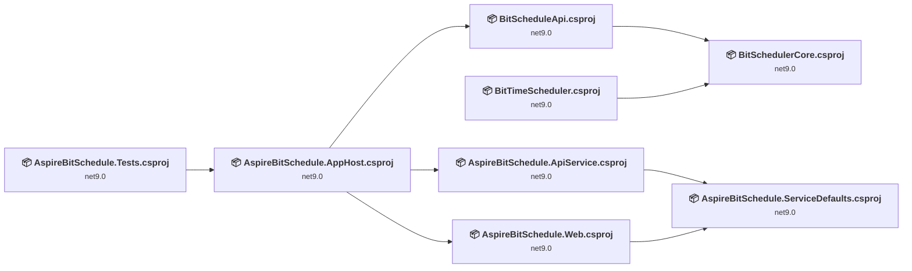
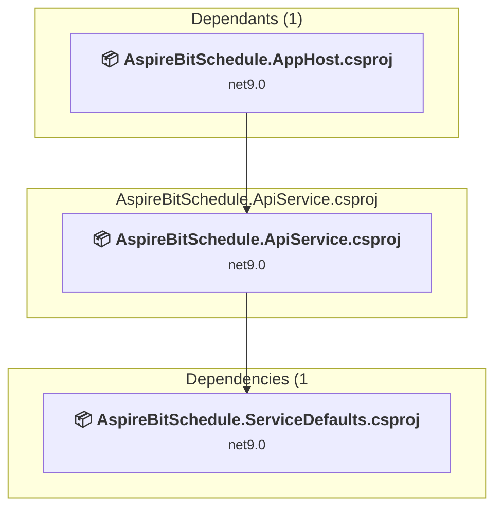
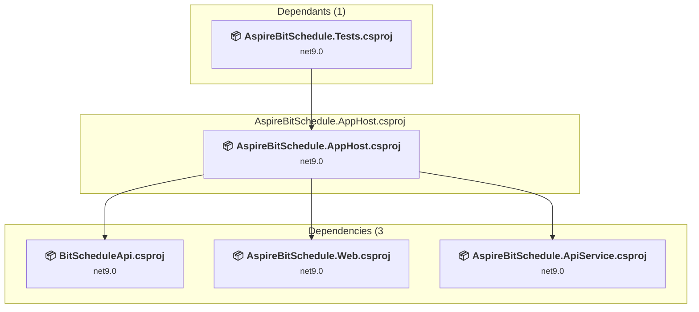
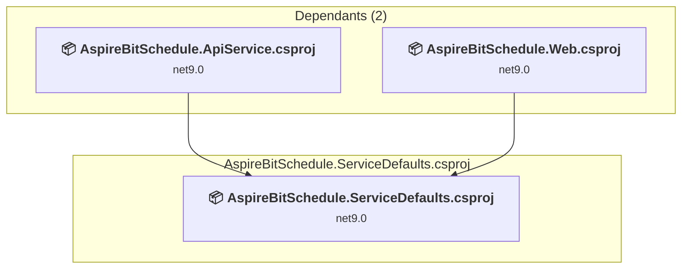
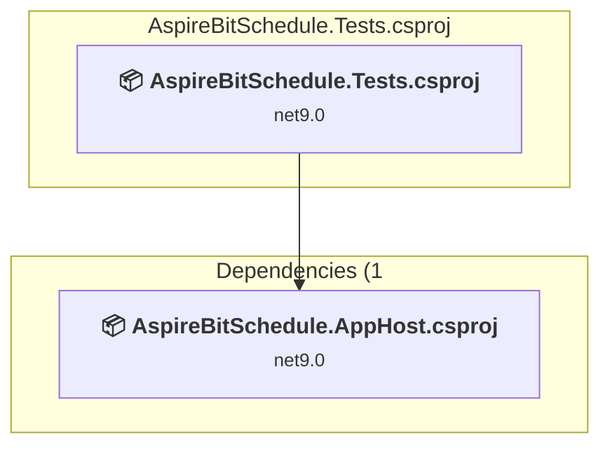
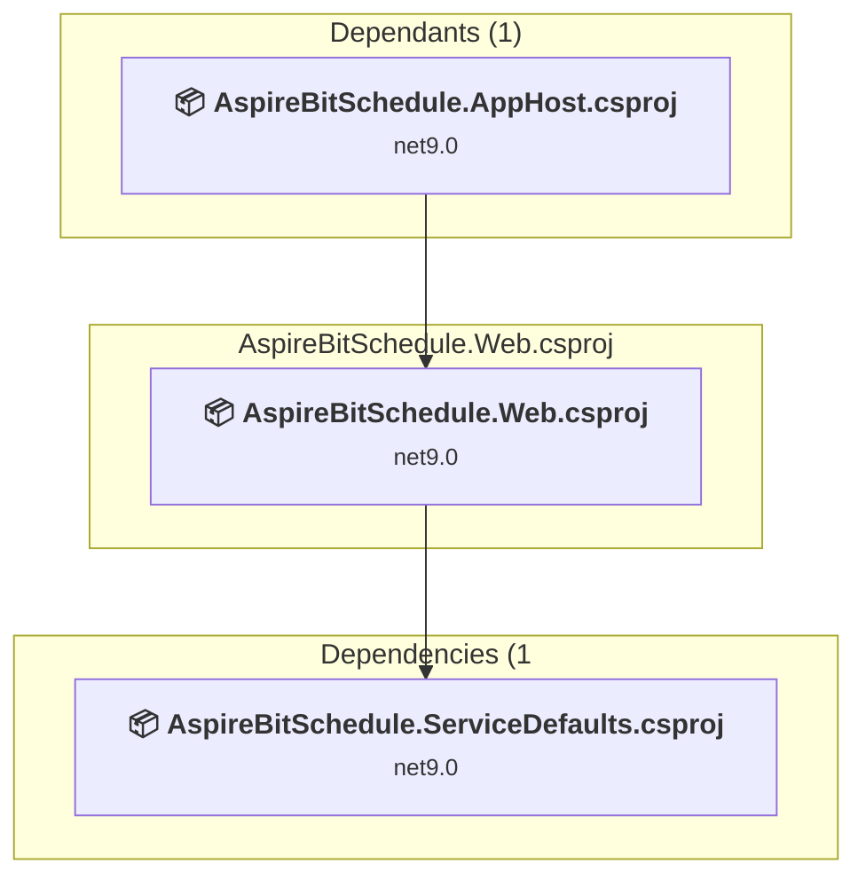
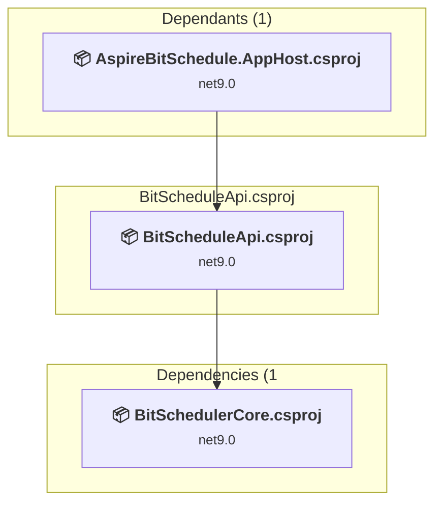
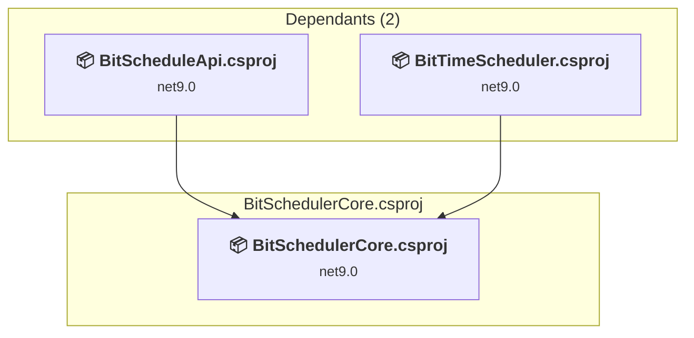
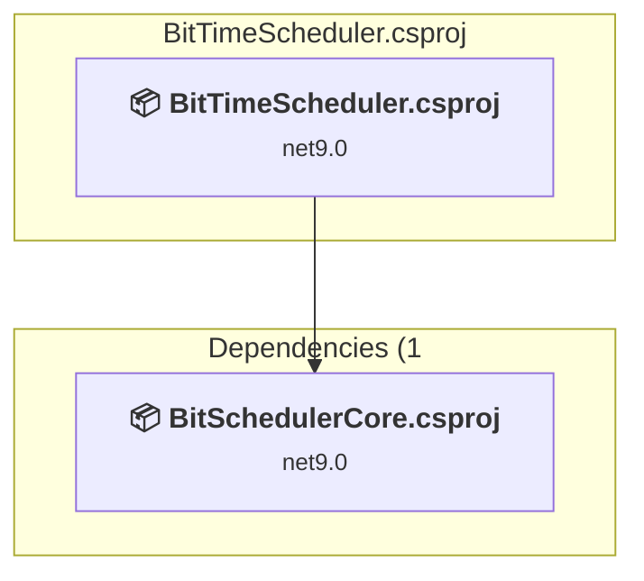

# Projects and dependencies analysis

This document provides a comprehensive overview of the projects and their dependencies in the context of upgrading to .NETCoreApp,Version=v10.0.

## Table of Contents

- [Executive Summary](#executive-Summary)
  - [Highlevel Metrics](#highlevel-metrics)
  - [Projects Compatibility](#projects-compatibility)
  - [Package Compatibility](#package-compatibility)
  - [API Compatibility](#api-compatibility)
- [Aggregate NuGet packages details](#aggregate-nuget-packages-details)
- [Top API Migration Challenges](#top-api-migration-challenges)
  - [Technologies and Features](#technologies-and-features)
  - [Most Frequent API Issues](#most-frequent-api-issues)
- [Projects Relationship Graph](#projects-relationship-graph)
- [Project Details](#project-details)

  - [AspireBitSchedule.ApiService\AspireBitSchedule.ApiService.csproj](#aspirebitscheduleapiserviceaspirebitscheduleapiservicecsproj)
  - [AspireBitSchedule.AppHost\AspireBitSchedule.AppHost.csproj](#aspirebitscheduleapphostaspirebitscheduleapphostcsproj)
  - [AspireBitSchedule.ServiceDefaults\AspireBitSchedule.ServiceDefaults.csproj](#aspirebitscheduleservicedefaultsaspirebitscheduleservicedefaultscsproj)
  - [AspireBitSchedule.Tests\AspireBitSchedule.Tests.csproj](#aspirebitscheduletestsaspirebitscheduletestscsproj)
  - [AspireBitSchedule.Web\AspireBitSchedule.Web.csproj](#aspirebitschedulewebaspirebitschedulewebcsproj)
  - [BitScheduleApi\BitScheduleApi.csproj](#bitscheduleapibitscheduleapicsproj)
  - [BitSchedulerCore\BitSchedulerCore.csproj](#bitschedulercorebitschedulercorecsproj)
  - [BitTimeScheduler\BitTimeScheduler.csproj](#bittimeschedulerbittimeschedulercsproj)

## Executive Summary

### Highlevel Metrics

| Metric | Count | Status |
| :--- | :---: | :--- |
| Total Projects | 8 | All require upgrade |
| Total NuGet Packages | 22 | 16 need upgrade |
| Total Code Files | 38 |  |
| Total Code Files with Incidents | 16 |  |
| Total Lines of Code | 4978 |  |
| Total Number of Issues | 75 |  |
| Estimated LOC to modify | 42+ | at least 0.8% of codebase |

### Projects Compatibility

| Project | Target Framework | Difficulty | Package Issues | API Issues | Est. LOC Impact | Description |
| :--- | :---: | :---: | :---: | :---: | :---: | :--- |
| [AspireBitSchedule.ApiService\AspireBitSchedule.ApiService.csproj](#aspirebitscheduleapiserviceaspirebitscheduleapiservicecsproj) | net9.0 | 🟢 Low | 1 | 1 | 1+ | AspNetCore, Sdk Style = True |
| [AspireBitSchedule.AppHost\AspireBitSchedule.AppHost.csproj](#aspirebitscheduleapphostaspirebitscheduleapphostcsproj) | net9.0 | 🟢 Low | 2 | 0 |  | DotNetCoreApp, Sdk Style = True |
| [AspireBitSchedule.ServiceDefaults\AspireBitSchedule.ServiceDefaults.csproj](#aspirebitscheduleservicedefaultsaspirebitscheduleservicedefaultscsproj) | net9.0 | 🟢 Low | 6 | 0 |  | ClassLibrary, Sdk Style = True |
| [AspireBitSchedule.Tests\AspireBitSchedule.Tests.csproj](#aspirebitscheduletestsaspirebitscheduletestscsproj) | net9.0 | 🟢 Low | 3 | 1 | 1+ | DotNetCoreApp, Sdk Style = True |
| [AspireBitSchedule.Web\AspireBitSchedule.Web.csproj](#aspirebitschedulewebaspirebitschedulewebcsproj) | net9.0 | 🟢 Low | 0 | 4 | 4+ | AspNetCore, Sdk Style = True |
| [BitScheduleApi\BitScheduleApi.csproj](#bitscheduleapibitscheduleapicsproj) | net9.0 | 🟢 Low | 6 | 2 | 2+ | AspNetCore, Sdk Style = True |
| [BitSchedulerCore\BitSchedulerCore.csproj](#bitschedulercorebitschedulercorecsproj) | net9.0 | 🟢 Low | 2 | 3 | 3+ | ClassLibrary, Sdk Style = True |
| [BitTimeScheduler\BitTimeScheduler.csproj](#bittimeschedulerbittimeschedulercsproj) | net9.0 | 🟢 Low | 5 | 31 | 31+ | DotNetCoreApp, Sdk Style = True |

### Package Compatibility

| Status | Count | Percentage |
| :--- | :---: | :---: |
| ✅ Compatible | 6 | 27.3% |
| ⚠️ Incompatible | 1 | 4.5% |
| 🔄 Upgrade Recommended | 15 | 68.2% |
| ***Total NuGet Packages*** | ***22*** | ***100%*** |

### API Compatibility

| Category | Count | Impact |
| :--- | :---: | :--- |
| 🔴 Binary Incompatible | 0 | High - Require code changes |
| 🟡 Source Incompatible | 37 | Medium - Needs re-compilation and potential conflicting API error fixing |
| 🔵 Behavioral change | 5 | Low - Behavioral changes that may require testing at runtime |
| ✅ Compatible | 4940 |  |
| ***Total APIs Analyzed*** | ***4982*** |  |

## Aggregate NuGet packages details

| Package | Current Version | Suggested Version | Projects | Description |
| :--- | :---: | :---: | :--- | :--- |
| Aspire.Hosting.AppHost | 9.0.0 | 13.3.5 | [AspireBitSchedule.AppHost.csproj](#aspirebitscheduleapphostaspirebitscheduleapphostcsproj) | NuGet package upgrade is recommended |
| Aspire.Hosting.Testing | 9.0.0 | 13.3.5 | [AspireBitSchedule.Tests.csproj](#aspirebitscheduletestsaspirebitscheduletestscsproj) | NuGet package upgrade is recommended |
| coverlet.collector | 6.0.2 |  | [AspireBitSchedule.Tests.csproj](#aspirebitscheduletestsaspirebitscheduletestscsproj) | ✅Compatible |
| Microsoft.AspNetCore.OpenApi | 9.0.0 | 10.0.8 | [AspireBitSchedule.ApiService.csproj](#aspirebitscheduleapiserviceaspirebitscheduleapiservicecsproj) | NuGet package upgrade is recommended |
| Microsoft.AspNetCore.OpenApi | 9.0.4 | 10.0.8 | [BitScheduleApi.csproj](#bitscheduleapibitscheduleapicsproj) | NuGet package upgrade is recommended |
| Microsoft.EntityFrameworkCore | 9.0.4 | 10.0.8 | [BitScheduleApi.csproj](#bitscheduleapibitscheduleapicsproj) [BitSchedulerCore.csproj](#bitschedulercorebitschedulercorecsproj) [BitTimeScheduler.csproj](#bittimeschedulerbittimeschedulercsproj) | NuGet package upgrade is recommended |
| Microsoft.EntityFrameworkCore.SqlServer | 9.0.4 | 10.0.8 | [BitScheduleApi.csproj](#bitscheduleapibitscheduleapicsproj) [BitSchedulerCore.csproj](#bitschedulercorebitschedulercorecsproj) [BitTimeScheduler.csproj](#bittimeschedulerbittimeschedulercsproj) | NuGet package upgrade is recommended |
| Microsoft.EntityFrameworkCore.Tools | 9.0.4 | 10.0.8 | [BitScheduleApi.csproj](#bitscheduleapibitscheduleapicsproj) | NuGet package upgrade is recommended |
| Microsoft.Extensions.Configuration | 9.0.0 | 10.0.8 | [BitTimeScheduler.csproj](#bittimeschedulerbittimeschedulercsproj) | NuGet package upgrade is recommended |
| Microsoft.Extensions.Configuration.FileExtensions | 9.0.0 | 10.0.8 | [BitScheduleApi.csproj](#bitscheduleapibitscheduleapicsproj) [BitTimeScheduler.csproj](#bittimeschedulerbittimeschedulercsproj) | NuGet package upgrade is recommended |
| Microsoft.Extensions.Configuration.Json | 9.0.0 | 10.0.8 | [BitScheduleApi.csproj](#bitscheduleapibitscheduleapicsproj) [BitTimeScheduler.csproj](#bittimeschedulerbittimeschedulercsproj) | NuGet package upgrade is recommended |
| Microsoft.Extensions.Http.Resilience | 9.0.0 | 10.6.0 | [AspireBitSchedule.ServiceDefaults.csproj](#aspirebitscheduleservicedefaultsaspirebitscheduleservicedefaultscsproj) | NuGet package upgrade is recommended |
| Microsoft.Extensions.ServiceDiscovery | 9.0.0 | 10.6.0 | [AspireBitSchedule.ServiceDefaults.csproj](#aspirebitscheduleservicedefaultsaspirebitscheduleservicedefaultscsproj) | NuGet package upgrade is recommended |
| Microsoft.NET.Test.Sdk | 17.10.0 |  | [AspireBitSchedule.Tests.csproj](#aspirebitscheduletestsaspirebitscheduletestscsproj) | ✅Compatible |
| OpenTelemetry.Exporter.OpenTelemetryProtocol | 1.9.0 | 1.15.3 | [AspireBitSchedule.ServiceDefaults.csproj](#aspirebitscheduleservicedefaultsaspirebitscheduleservicedefaultscsproj) | NuGet package contains security vulnerability |
| OpenTelemetry.Extensions.Hosting | 1.9.0 |  | [AspireBitSchedule.ServiceDefaults.csproj](#aspirebitscheduleservicedefaultsaspirebitscheduleservicedefaultscsproj) | ✅Compatible |
| OpenTelemetry.Instrumentation.AspNetCore | 1.9.0 | 1.15.2 | [AspireBitSchedule.ServiceDefaults.csproj](#aspirebitscheduleservicedefaultsaspirebitscheduleservicedefaultscsproj) | NuGet package upgrade is recommended |
| OpenTelemetry.Instrumentation.Http | 1.9.0 | 1.15.1 | [AspireBitSchedule.ServiceDefaults.csproj](#aspirebitscheduleservicedefaultsaspirebitscheduleservicedefaultscsproj) | NuGet package upgrade is recommended |
| OpenTelemetry.Instrumentation.Runtime | 1.9.0 |  | [AspireBitSchedule.ServiceDefaults.csproj](#aspirebitscheduleservicedefaultsaspirebitscheduleservicedefaultscsproj) | ✅Compatible |
| Swashbuckle.AspNetCore | 8.1.1 |  | [BitScheduleApi.csproj](#bitscheduleapibitscheduleapicsproj) | ✅Compatible |
| xunit | 2.9.0 |  | [AspireBitSchedule.Tests.csproj](#aspirebitscheduletestsaspirebitscheduletestscsproj) | ⚠️NuGet package is deprecated |
| xunit.runner.visualstudio | 2.8.2 |  | [AspireBitSchedule.Tests.csproj](#aspirebitscheduletestsaspirebitscheduletestscsproj) | ✅Compatible |

## Top API Migration Challenges

### Technologies and Features

| Technology | Issues | Percentage | Migration Path |
| :--- | :---: | :---: | :--- |

### Most Frequent API Issues

| API | Count | Percentage | Category |
| :--- | :---: | :---: | :--- |
| M:System.TimeSpan.FromHours(System.Int32) | 23 | 54.8% | Source Incompatible |
| M:System.TimeSpan.FromMinutes(System.Int64) | 13 | 31.0% | Source Incompatible |
| T:System.Uri | 2 | 4.8% | Behavioral Change |
| M:Microsoft.AspNetCore.Builder.ExceptionHandlerExtensions.UseExceptionHandler(Microsoft.AspNetCore.Builder.IApplicationBuilder) | 1 | 2.4% | Behavioral Change |
| M:System.TimeSpan.FromSeconds(System.Int64) | 1 | 2.4% | Source Incompatible |
| M:Microsoft.AspNetCore.Builder.ExceptionHandlerExtensions.UseExceptionHandler(Microsoft.AspNetCore.Builder.IApplicationBuilder,System.String,System.Boolean) | 1 | 2.4% | Behavioral Change |
| M:System.Uri.#ctor(System.String) | 1 | 2.4% | Behavioral Change |

## Projects Relationship Graph

Legend:
📦 SDK-style project
⚙️ Classic project

## Project Details

### AspireBitSchedule.ApiService\AspireBitSchedule.ApiService.csproj

#### Project Info

- **Current Target Framework:** net9.0
- **Proposed Target Framework:** net10.0
- **SDK-style**: True
- **Project Kind:** AspNetCore
- **Dependencies**: 1
- **Dependants**: 1
- **Number of Files**: 3
- **Number of Files with Incidents**: 2
- **Lines of Code**: 45
- **Estimated LOC to modify**: 1+ (at least 2.2% of the project)

#### Dependency Graph

Legend:
📦 SDK-style project
⚙️ Classic project

### API Compatibility

| Category | Count | Impact |
| :--- | :---: | :--- |
| 🔴 Binary Incompatible | 0 | High - Require code changes |
| 🟡 Source Incompatible | 0 | Medium - Needs re-compilation and potential conflicting API error fixing |
| 🔵 Behavioral change | 1 | Low - Behavioral changes that may require testing at runtime |
| ✅ Compatible | 100 |  |
| ***Total APIs Analyzed*** | ***101*** |  |

### AspireBitSchedule.AppHost\AspireBitSchedule.AppHost.csproj

#### Project Info

- **Current Target Framework:** net9.0
- **Proposed Target Framework:** net10.0
- **SDK-style**: True
- **Project Kind:** DotNetCoreApp
- **Dependencies**: 3
- **Dependants**: 1
- **Number of Files**: 1
- **Number of Files with Incidents**: 1
- **Lines of Code**: 11
- **Estimated LOC to modify**: 0+ (at least 0.0% of the project)

#### Dependency Graph

Legend:
📦 SDK-style project
⚙️ Classic project

### API Compatibility

| Category | Count | Impact |
| :--- | :---: | :--- |
| 🔴 Binary Incompatible | 0 | High - Require code changes |
| 🟡 Source Incompatible | 0 | Medium - Needs re-compilation and potential conflicting API error fixing |
| 🔵 Behavioral change | 0 | Low - Behavioral changes that may require testing at runtime |
| ✅ Compatible | 46 |  |
| ***Total APIs Analyzed*** | ***46*** |  |

### AspireBitSchedule.ServiceDefaults\AspireBitSchedule.ServiceDefaults.csproj

#### Project Info

- **Current Target Framework:** net9.0
- **Proposed Target Framework:** net10.0
- **SDK-style**: True
- **Project Kind:** ClassLibrary
- **Dependencies**: 0
- **Dependants**: 2
- **Number of Files**: 1
- **Number of Files with Incidents**: 1
- **Lines of Code**: 119
- **Estimated LOC to modify**: 0+ (at least 0.0% of the project)

#### Dependency Graph

Legend:
📦 SDK-style project
⚙️ Classic project

### API Compatibility

| Category | Count | Impact |
| :--- | :---: | :--- |
| 🔴 Binary Incompatible | 0 | High - Require code changes |
| 🟡 Source Incompatible | 0 | Medium - Needs re-compilation and potential conflicting API error fixing |
| 🔵 Behavioral change | 0 | Low - Behavioral changes that may require testing at runtime |
| ✅ Compatible | 102 |  |
| ***Total APIs Analyzed*** | ***102*** |  |

### AspireBitSchedule.Tests\AspireBitSchedule.Tests.csproj

#### Project Info

- **Current Target Framework:** net9.0
- **Proposed Target Framework:** net10.0
- **SDK-style**: True
- **Project Kind:** DotNetCoreApp
- **Dependencies**: 1
- **Dependants**: 0
- **Number of Files**: 3
- **Number of Files with Incidents**: 2
- **Lines of Code**: 28
- **Estimated LOC to modify**: 1+ (at least 3.6% of the project)

#### Dependency Graph

Legend:
📦 SDK-style project
⚙️ Classic project

### API Compatibility

| Category | Count | Impact |
| :--- | :---: | :--- |
| 🔴 Binary Incompatible | 0 | High - Require code changes |
| 🟡 Source Incompatible | 1 | Medium - Needs re-compilation and potential conflicting API error fixing |
| 🔵 Behavioral change | 0 | Low - Behavioral changes that may require testing at runtime |
| ✅ Compatible | 46 |  |
| ***Total APIs Analyzed*** | ***47*** |  |

### AspireBitSchedule.Web\AspireBitSchedule.Web.csproj

#### Project Info

- **Current Target Framework:** net9.0
- **Proposed Target Framework:** net10.0
- **SDK-style**: True
- **Project Kind:** AspNetCore
- **Dependencies**: 1
- **Dependants**: 1
- **Number of Files**: 15
- **Number of Files with Incidents**: 2
- **Lines of Code**: 73
- **Estimated LOC to modify**: 4+ (at least 5.5% of the project)

#### Dependency Graph

Legend:
📦 SDK-style project
⚙️ Classic project

### API Compatibility

| Category | Count | Impact |
| :--- | :---: | :--- |
| 🔴 Binary Incompatible | 0 | High - Require code changes |
| 🟡 Source Incompatible | 0 | Medium - Needs re-compilation and potential conflicting API error fixing |
| 🔵 Behavioral change | 4 | Low - Behavioral changes that may require testing at runtime |
| ✅ Compatible | 596 |  |
| ***Total APIs Analyzed*** | ***600*** |  |

### BitScheduleApi\BitScheduleApi.csproj

#### Project Info

- **Current Target Framework:** net9.0
- **Proposed Target Framework:** net10.0
- **SDK-style**: True
- **Project Kind:** AspNetCore
- **Dependencies**: 1
- **Dependants**: 1
- **Number of Files**: 4
- **Number of Files with Incidents**: 2
- **Lines of Code**: 538
- **Estimated LOC to modify**: 2+ (at least 0.4% of the project)

#### Dependency Graph

Legend:
📦 SDK-style project
⚙️ Classic project

### API Compatibility

| Category | Count | Impact |
| :--- | :---: | :--- |
| 🔴 Binary Incompatible | 0 | High - Require code changes |
| 🟡 Source Incompatible | 2 | Medium - Needs re-compilation and potential conflicting API error fixing |
| 🔵 Behavioral change | 0 | Low - Behavioral changes that may require testing at runtime |
| ✅ Compatible | 286 |  |
| ***Total APIs Analyzed*** | ***288*** |  |

### BitSchedulerCore\BitSchedulerCore.csproj

#### Project Info

- **Current Target Framework:** net9.0
- **Proposed Target Framework:** net10.0
- **SDK-style**: True
- **Project Kind:** ClassLibrary
- **Dependencies**: 0
- **Dependants**: 2
- **Number of Files**: 26
- **Number of Files with Incidents**: 3
- **Lines of Code**: 3015
- **Estimated LOC to modify**: 3+ (at least 0.1% of the project)

#### Dependency Graph

Legend:
📦 SDK-style project
⚙️ Classic project

### API Compatibility

| Category | Count | Impact |
| :--- | :---: | :--- |
| 🔴 Binary Incompatible | 0 | High - Require code changes |
| 🟡 Source Incompatible | 3 | Medium - Needs re-compilation and potential conflicting API error fixing |
| 🔵 Behavioral change | 0 | Low - Behavioral changes that may require testing at runtime |
| ✅ Compatible | 2804 |  |
| ***Total APIs Analyzed*** | ***2807*** |  |

### BitTimeScheduler\BitTimeScheduler.csproj

#### Project Info

- **Current Target Framework:** net9.0
- **Proposed Target Framework:** net10.0
- **SDK-style**: True
- **Project Kind:** DotNetCoreApp
- **Dependencies**: 1
- **Dependants**: 0
- **Number of Files**: 6
- **Number of Files with Incidents**: 3
- **Lines of Code**: 1149
- **Estimated LOC to modify**: 31+ (at least 2.7% of the project)

#### Dependency Graph

Legend:
📦 SDK-style project
⚙️ Classic project

### API Compatibility

| Category | Count | Impact |
| :--- | :---: | :--- |
| 🔴 Binary Incompatible | 0 | High - Require code changes |
| 🟡 Source Incompatible | 31 | Medium - Needs re-compilation and potential conflicting API error fixing |
| 🔵 Behavioral change | 0 | Low - Behavioral changes that may require testing at runtime |
| ✅ Compatible | 960 |  |
| ***Total APIs Analyzed*** | ***991*** |  |

